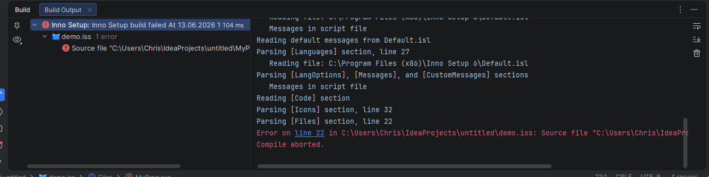

# Build Integration

The plugin integrates Inno Setup's command-line compiler **ISCC** directly into the IDE so you can compile
`.iss` scripts without leaving your editor. Before using any build feature, make sure the Inno Setup installation
directory is configured under **Build, Execution, Deployment → Inno Setup → General** (see [Settings](settings.md)).

---

## Triggering a Build

### Context-Menu Action

Right-click any `.iss` file in the Project view or editor tab and choose **Build Inno Setup Script**.
The action is only visible for `.iss` files and is disabled (with an explanation tooltip) for scripts that are
`#include`d by another script — those must be built via their top-level parent.

### Automatic Build on Project Build

When **Compile .iss files on project build** is enabled in the
[Build Settings](settings-build.md), all top-level `.iss` scripts in the project are compiled automatically every
time the IDE builds the project (e.g. via **Build → Build Project** or the hammer icon).
Scripts that are included by other scripts are skipped automatically.

---

## Build Output Console

The build result appears in the **Build** tool window under a dedicated **Inno Setup** node. Each compiled
script gets its own child node showing its name and the number of errors or warnings.

### Console Output

The right-hand panel shows the raw ISCC output line by line — progress messages, section parsing notes,
and any compiler diagnostics:

| Line type   | Appearance        | Example                                                          |
|-------------|-------------------|------------------------------------------------------------------|
| **Progress** | plain white text  | `Parsing [Files] section, line 22`                               |
| **Error**   | red text          | `Error on line 22 in C:\...\demo.iss: Source file "..." not found` |
| **Warning** | yellow text       | `Warning on line 5 in C:\...\demo.iss: ...`                      |

### Structured Section Output & Folding

The ISCC output is presented in a structured form instead of one long flat log:

- **Section nodes** — consecutive output lines that belong to the same Inno Setup section
  (`Parsing [Setup] section …`, `Parsing [Languages] section …`, …) are grouped into a single node in
  the Build tree, labelled with the section name and the number of folded lines, e.g. **`[Setup] (8)`**.
  A section node is **always** shown, regardless of the overall build status, and carries a severity of
  **INFO**, **WARN** or **ERROR** depending on its content.
- **Console folds** — within the console, indented detail lines (e.g. the `Reading file: …` /
  `Messages in script file` lines below `[Languages]`) are collapsed by default into a fold whose
  placeholder reports the number of hidden lines. Expand a fold to inspect the individual lines.

This keeps the output compact: you see one entry per section at a glance and can drill into the details
only where needed.

### Navigable Error Links

Error and warning lines that include a file position contain a clickable **`line XX`** hyperlink.
Clicking it opens the referenced `.iss` file and moves the caret directly to the reported line and column,
so you can fix problems without manually searching the script.

### Build Tree

The left-hand tree in the Build tool window summarises the result:

- A **red error icon** on the script node indicates at least one compiler error.
- A **yellow warning icon** indicates warnings but no errors.
- Individual problem entries are listed as child nodes; clicking one navigates to the source location.

---

## Output Modes

The output location for the compiled installer can be controlled per project via the
[Build Settings](settings-build.md):

| Mode                                     | ISCC flag | Description                                                                       |
|------------------------------------------|-----------|-----------------------------------------------------------------------------------|
| **As defined in script** *(script)*      | *(none)*  | Uses the `OutputDir` from `[Setup]` unchanged                                     |
| **Into project build directory** *(default)* | `/O`  | Redirects a relative `OutputDir` into the project's build folder (`out`/`target`/`build`) |
| **Dry build — validate only, no output** | `/O-`     | Validates the script without producing a setup file; useful for CI checks         |
