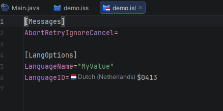

# Inno Setup 言語ファイル

このプラグインはインストーラースクリプト（`.iss`）に加えて Inno Setup 言語ファイル（`.isl`）もサポートします。言語ファイルはスクリプトと同じエディターインフラを使用しますが、言語固有のセクションのみ有効です。

---

## サポートされるセクション

`.isl` ファイルには以下を含めることができます：

- `[LangOptions]` — 言語メタデータ、ロケール識別子、フォント、テキスト方向
- `[Messages]` — 翻訳された組み込みインストーラーメッセージ
- `[CustomMessages]` — `{cm:...}` を通じて参照される翻訳されたプロジェクト固有のメッセージ

`.isl` ファイルには `[Setup]` は必要ありません。代わりに、`[LangOptions]` で `LanguageName` と `LanguageID` を定義する必要があります。

---

## 編集機能

### シンタックスハイライト

`.iss` ファイルで使用されているのと同じカラースキームが `.isl` ファイルにも適用されます：

- **セクションヘッダー**（`[LangOptions]`、`[Messages]`、`[CustomMessages]`）が構造マーカーとしてハイライト表示される
- **ディレクティブキー**とその値が個別に色付けされる
- **メッセージキー**が翻訳済み文字列値と区別して表示される

### コード補完

`.isl` ファイル内でコンテキスト対応の候補が提供されます：

- 受け入れ可能な値タイプを持つ既知の `[LangOptions]` ディレクティブキー
- **フラグアイコン**、ロケール名、16 進数 LCID 付きの `LanguageID` 値 — Inno Setup の組み込み言語がリストの先頭に表示される

### インレイヒント

`LanguageID` 値に対応する**フラグアイコンとロケール名**（例：*Dutch (Netherlands) $0413*）がインラインで注釈付けされ、外部ドキュメントで16進数識別子を調べなくても言語をすぐに認識できます。

### インラインドキュメント

任意の `[LangOptions]` キーにカーソルを当てると、バンドルされた仕様から説明が表示されます（受け入れ可能な値と注意事項を含む）。

### バリデーション

アノテーターは `.isl` ファイルの問題をハイライト表示します：

- 不明またはスペルミスの `[LangOptions]` キー
- 無効または認識されない `LanguageID` 値
- `[LangOptions]` 内の不足している必須ディレクティブ

### 言語プレフィックス参照

メッセージキーは `.iss` スクリプト内で使用する際に `german.WelcomeLabel1` のような言語プレフィックスを持つことができます。これらのプレフィックスは `[Languages]` の `Name:` エントリーに解決され、以下に完全に参加します：

- **定義へ移動** — プレフィックスからその `[Languages]` 宣言へジャンプ
- **使用箇所の検索** — 特定の言語名を参照するすべての場所を検索
- **リネームリファクタリング** — 言語名をリネームしてすべてのプレフィックス付き使用箇所を一貫して更新
