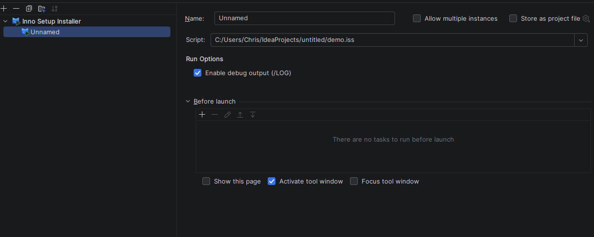

# 실행 구성

이 플러그인은 전용 **Inno Setup** 실행 구성 유형을 제공하여 IDE 내에서 `.iss` 스크립트를 컴파일하고 생성된 설치 프로그램을 즉시 실행할 수 있습니다.

---

## 실행 구성 만들기

프로젝트 뷰에서 **`.iss` 파일을 마우스 오른쪽 버튼으로 클릭**하고 **실행** 또는 **디버그**를 선택하면 실행 구성이 자동으로 생성됩니다. **실행 → 구성 편집…** 을 통해 수동으로 만들 수도
있으며, **+** 를 클릭한 후 **Inno Setup**을 선택하면 됩니다.

---

## 구성 옵션

| 옵션         | 설명                                                                              |
|------------|---------------------------------------------------------------------------------|
| **스크립트**   | 컴파일할 최상위 `.iss` 스크립트 경로. 드롭다운에는 프로젝트에서 찾은 모든 최상위 스크립트가 나열되며 경로를 직접 입력할 수도 있습니다. |
| **언어**     | 실행 시 설치 프로그램 언어를 선택합니다. 스크립트의 `[Languages]` 섹션에 두 개 이상의 항목이 있는 경우에만 표시됩니다.      |
| **디버그 출력** | 활성화하면 설치 프로그램에 `/DBGMSG`가 전달되어 설치 중 진단 메시지가 콘솔에 출력됩니다.                          |

---

## 작동 방식

1. 스크립트가 ISCC로 컴파일됩니다([빌드 통합](build.md)과 동일한 파이프라인).
2. 프로젝트 출력 모드가 **드라이 빌드**로 설정된 경우, 플러그인이 자동으로 출력을 임시 디렉토리로 리디렉션하여 실제 설치 프로그램을 생성하고 실행할 수 있도록 합니다.
3. 생성된 `setup.exe`가 실행되며, 프로세스 출력이 **실행** 도구 창에 스트리밍됩니다.
