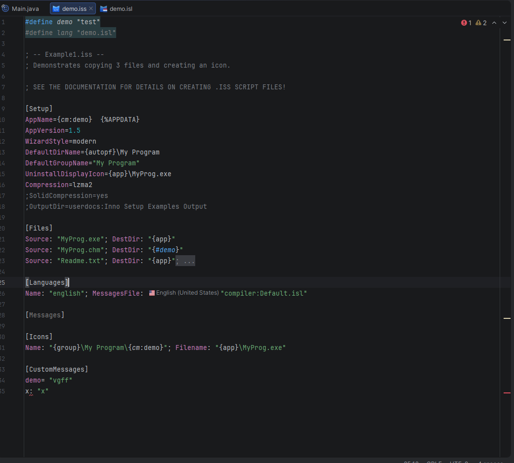

# Inno Setup Script Files

The plugin supports Inno Setup script files (`.iss`) as the main installer definition format. Script files describe what
the installer builds, what it installs, which languages it offers, and which runtime actions are executed by Setup and
Uninstall.

---

## Supported Sections

`.iss` files may contain:

- `[Setup]` for installer metadata, output settings, wizard behavior, privileges, signing, compression, and version
  requirements
- `[Types]`, `[Components]`, and `[Tasks]` for selectable install modes, feature groups, and optional actions
- `[Dirs]`, `[Files]`, `[Icons]`, `[Registry]`, `[INI]`, `[InstallDelete]`, and `[UninstallDelete]` for filesystem,
  shortcut, registry, INI, and cleanup operations
- `[Run]` and `[UninstallRun]` for commands executed during install or uninstall
- `[Languages]`, `[LangOptions]`, `[Messages]`, and `[CustomMessages]` for multilingual installers and localized text
- `[ISSigKeys]` for public keys used by `.issig` signature verification
- `[Code]` for Pascal Script custom logic

`[Setup]` is the central script section and is required for normal installer scripts. Other sections are optional and
can be combined as needed for the installer workflow.

---

## Editing Features

### Syntax Highlighting

Every element of the script is coloured distinctly:

- **Section headers** (`[Setup]`, `[Files]`, …) stand out as structural markers
- **Directive keys** and **parameter keys** are highlighted separately from their values
- **Built-in constants** such as `{app}`, `{autopf}`, `{group}`, and `{cm:…}` are coloured inside values and strings
- **ISPP preprocessor lines** (`#define`, `#include`, `#if`, …) at the top of the file receive their own colour scheme
- **Comments** (`;`-prefixed lines) are visually muted

### Code Completion

Context-aware suggestions are offered as you type:

- Section names after `[`
- Directive keys in `[Setup]` and parameter keys in all other sections
- Known flag values and enumerated option values
- ISPP variable names after `{#` and after `#define`/`#include` keywords
- Language identifiers for `Languages:` parameters, with flag icon and locale name

### Inline Documentation

Hover over any directive key or parameter key to read its description from the bundled Inno Setup spec, including the
list of accepted values and remarks, without leaving the editor.

### Reference Resolution

The plugin resolves cross-references between declarations and their usages:

| Reference type         | Declaration                      | Usage                                          |
|------------------------|----------------------------------|------------------------------------------------|
| Tasks / Components / Types | `Name:` in `[Tasks]` / `[Components]` / `[Types]` | `Tasks:`, `Components:`, `Types:` parameters   |
| ISPP definitions       | `#define Name`                   | `{#Name}` inside values and strings            |
| Language prefixes      | `Name:` in `[Languages]`         | `german.MessageKey` in `[Messages]`            |
| Custom messages        | `Key=` in `[CustomMessages]`     | `{cm:Key}` constants inside values             |

Go-to-definition (**Ctrl+B** / **Cmd+B**) and Find Usages (**Alt+F7**) work for all supported reference types.
Rename refactoring keeps all usages consistent.

### Inlay Hints

Language flag icons are shown inline next to `MessagesFile:` values in `[Languages]` entries. The hint
displays the locale name (e.g. *English (United States)*) so the referenced language is immediately visible
without opening the `.isl` file.

### Validation and Quick-Fixes

The annotator highlights problems directly in the editor:

- Unknown or misspelled directive / parameter keys
- Missing required parameters (with a quick-fix to add them)
- Redundant flags (with a quick-fix to remove them)
- Trailing semicolons on the last parameter (with a quick-fix to strip them)
- `[Code]` not being the last section (with a quick-fix to move it)
- Empty sections (with a quick-fix to delete them)
- Missing required sections (with a quick-fix to add them)
- Unresolved constants and references

### Structure View

The Structure tool window (**Alt+7**) shows a bird's-eye tree of all sections and their entries. Clicking an
entry jumps to the corresponding line.

### Code Folding

Sections and long parameter entries can be folded independently to reduce visual noise when working with
large scripts.

### Brace and Quote Matching

The editor auto-closes `{`, `[`, and `"` and highlights matching pairs when the caret sits next to one.

### Code Entry Mover

Parameter entries within a section can be moved up or down with **Alt+Shift+Up/Down** without manually
cutting and pasting lines.

---

## Preprocessor (ISPP)

ISPP preprocessor directives are injected into script files and receive their own highlighting, completion,
rename, and Find Usages support for `#define` names. Inline `{#Name}` references inside section values
resolve to their `#define` declaration and participate in the same rename/find-usages flow.

See [Inno Setup Preprocessor](preprocessor/overview.md) for the supported directives, the standard
predefined variables, and inline `{#…}` emission.

---

## Building Scripts

Scripts can be compiled with ISCC directly from the IDE. See [Build Integration](build.md) for details.
