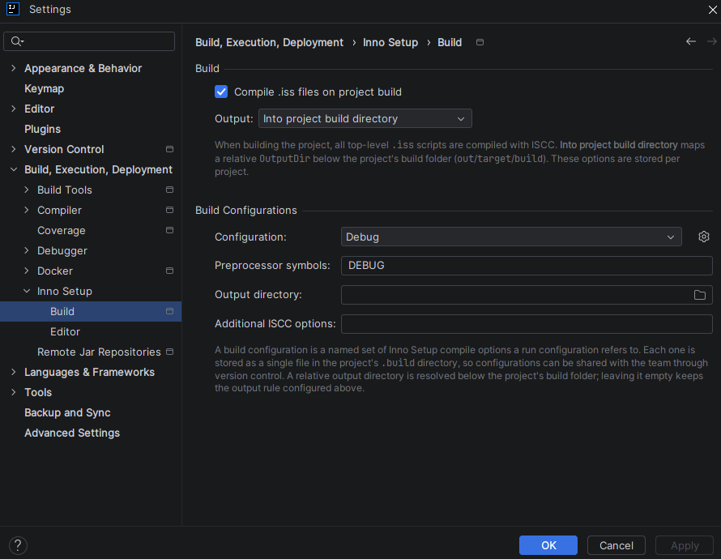

# 빌드 설정

**빌드** 하위 페이지는 IDE 설정의 **빌드, 실행, 배포 → Inno Setup → 빌드**에 있습니다.

이러한 설정은 **프로젝트 범위**입니다(전역이 아닌 프로젝트별로 저장됨).

---

## 빌드

| 옵션                        | 설명                                                            |
|---------------------------|---------------------------------------------------------------|
| **프로젝트 빌드 시 .iss 파일 컴파일** | 활성화하면 프로젝트를 빌드할 때마다 프로젝트의 모든 최상위 `.iss` 스크립트가 `ISCC`로 컴파일됩니다. |
| **출력**                    | 컴파일된 설치 프로그램 출력이 배치되는 위치를 제어합니다. 아래 값을 참조하세요.                 |

**출력 값**

| 값                          | 설명                                                                 |
|----------------------------|--------------------------------------------------------------------|
| **스크립트에 정의된 대로**           | 스크립트의 `[Setup] OutputDir`을 그대로 유지합니다——`ISCC`에 `/O` 스위치를 전달하지 않습니다. |
| **프로젝트 빌드 디렉토리로**(*기본값*)   | 상대 `OutputDir`을 프로젝트 빌드 폴더(`out`/`target`/`build`) 아래로 리디렉션합니다.    |
| **드라이 빌드——유효성 검사만, 출력 없음** | 네이티브 `ISCC` `/O-` 스위치를 전달하여 설치 파일 없이 스크립트를 검증합니다.                  |

---

## 빌드 구성

**빌드 구성**은 C/C++ 빌드 구성에 해당하는 Inno Setup의 개념으로, [실행 구성](run-configuration.md)이 이름으로 참조하는
이름 있는 컴파일 옵션 모음입니다. 옵션이 한곳에 모여 있으므로 여러 실행이 공유할 수 있고, 한 번 수정하면 참조하는 모든 곳에 반영됩니다.

| 옵션               | 설명                                                              |
|------------------|-----------------------------------------------------------------|
| **전처리기 심볼**      | 컴파일러에 `/D`로 전달되는 심볼(예: `DEBUG`, `VERSION=2`). 여러 개는 쉼표·세미콜론·공백으로 구분합니다. |
| **출력 디렉터리**      | 설치 프로그램이 기록될 위치를 재정의합니다. 상대 경로는 프로젝트 빌드 폴더 아래로 해석됩니다. 비워 두면 위의 **출력** 규칙이 유지됩니다. |
| **추가 ISCC 옵션**   | 그 밖의 원시 `ISCC` 명령줄 옵션을 공백으로 구분해 지정합니다. 공백이 포함된 값은 큰따옴표로 감쌉니다.  |

목록은 **추가**, **복사**, **이름 변경**, **제거**로 관리합니다. 구성은 최소한 하나가 남아 있어야 합니다.

### 기본값

빌드 구성이 아직 없는 프로젝트는 두 개의 구성으로 시작합니다.

| 이름          | 심볼      | 용도                  |
|-------------|---------|---------------------|
| **Release** | *(없음)*  | 아무것도 정의하지 않는 기본 빌드. |
| **Debug**   | `DEBUG` | 모든 새 실행 구성의 기본값.    |

### 저장 위치

각 구성은 `.idea` 옆에 있는 **프로젝트 `.build` 디렉터리의 단일 파일**로 저장됩니다 — 플랫폼이 공유 가능한 실행 구성을
`.run`에 두는 것과 같은 방식입니다. 구성마다 파일이 하나이므로 검토와 병합이 쉬우며, 버전 관리를 통해 팀과 공유할 수 있습니다.

### 빌드에 미치는 영향

선택된 빌드 구성의 내용은 빌드의 최신 상태 검사에 포함됩니다. 따라서 실행을 `Debug`에서 `Release`로 바꾸거나 `Debug`의 심볼만
수정해도 이전에 생성된 설치 프로그램은 무효가 되어 다시 빌드됩니다. 이름 변경은 그렇지 않습니다 — 이름은 컴파일된 내용의 일부가 아닙니다.
