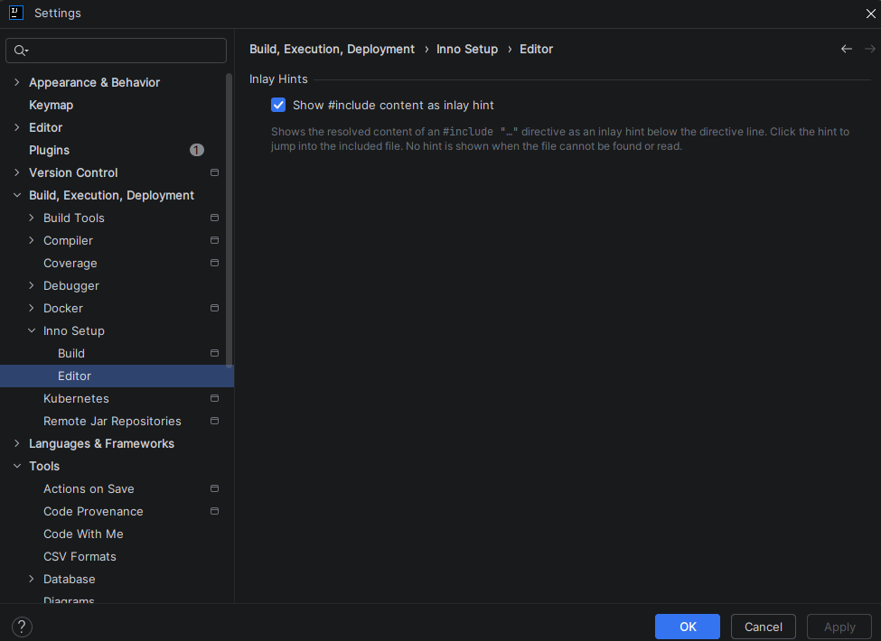

# 编辑器设置

**Inno Setup** 设置节点下的**编辑器**子页面控制 `.iss` 脚本在编辑器中的显示方式。

---

## 内嵌提示

| 选项                       | 说明                                                                                                  |
|--------------------------|-----------------------------------------------------------------------------------------------------|
| **将 #include 内容显示为内嵌提示** | 在指令行**下方**以内嵌提示显示 `#include "…"` 指令解析后的内容，并保留被包含文件的换行。点击提示可跳转到被包含的文件。当目标文件无法找到或无法读取时不显示提示。**默认启用。** |

这些设置是 **IDE 全局**的（保存在全局 IDE 配置中，而非按项目保存）。

---

## 常规设置

安装目录与版本验证请参阅[设置](settings.md)，项目范围的构建选项请参阅[构建设置](settings-build.md)。
