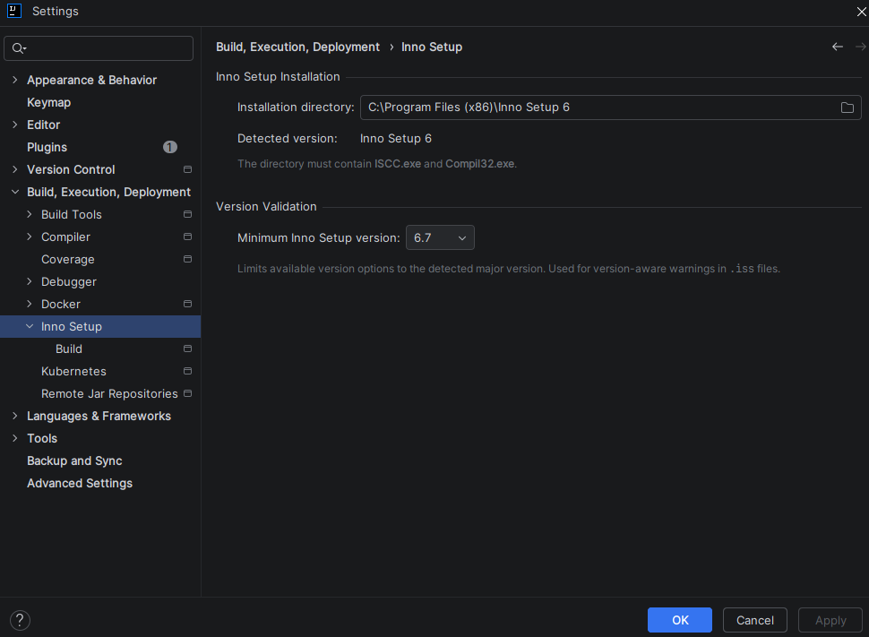

# 设置

该插件在 IDE 设置（Windows/Linux 上的**文件 → 设置**，macOS 上的 **IntelliJ IDEA → 设置**）的**构建、执行、部署**下添加了一个 **Inno Setup** 节点。

---

## Inno Setup 安装

| 选项                     | 说明                                                                             |
|--------------------------|----------------------------------------------------------------------------------|
| **安装目录**             | Inno Setup 安装文件夹的路径。必须包含 `ISCC.exe` 和 `Compil32.exe`。            |
| **检测到的版本**         | 显示所选目录中找到的 Inno Setup 版本的只读字段。                                 |

### 版本验证

| 选项                           | 说明                                                                                                                     |
|--------------------------------|--------------------------------------------------------------------------------------------------------------------------|
| **最低 Inno Setup 版本**       | 将可用版本选项限制为检测到的主要版本。用于 `.iss` 文件中版本感知的警告。                                                 |

这些设置是 **IDE 范围**的（存储在全局 IDE 配置中，而非每个项目）。

---

## 编辑器设置

有关编辑器显示选项（例如 `#include` 内容内嵌提示），请参阅[编辑器设置](settings-editor.md)。

---

## 构建设置

有关项目范围的构建选项，请参阅[构建设置](settings-build.md)。
