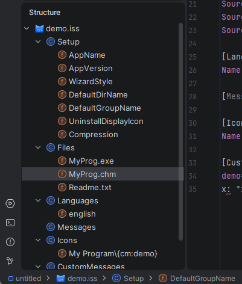

# Structure View

The plugin provides a fully integrated Structure View for `.iss` script files. It is available via the
**Structure** tool window (**Alt+7**) or the **Navigate → File Structure** popup (**Ctrl+F12**).

---

## Tree Layout

The structure tree mirrors the logical organisation of the script:

- The **root node** represents the `.iss` file itself (shown with the script file icon).
- **Section nodes** (e.g. `[Setup]`, `[Files]`, `[Languages]`) are direct children of the root, each
  shown with a section icon.
- **Entry nodes** are children of their section and represent individual directives, parameter entries,
  or message keys depending on the section type.

---

## Navigation

Clicking any node in the Structure View moves the editor caret directly to the corresponding line.
This makes it easy to jump between distant sections in a large script without scrolling.

When the caret moves in the editor, the Structure View **auto-scrolls** to highlight the entry that
contains the current position, keeping the tree in sync with the editor at all times.

---

## Entry Icons

Each entry is annotated with an icon that indicates its kind:

| Icon | Meaning                                                              |
|------|----------------------------------------------------------------------|
| `f`  | A field-like entry — a directive key or parameter key with its value |
| `C`  | A section container node                                             |

The file-type icon on the root node matches the `.iss` file icon used throughout the IDE.

---

## Breadcrumb Bar

The status bar at the bottom of the editor shows the **structural path** to the current caret position
(e.g. `demo.iss › [Setup] › DefaultGroupName`), giving a constant orientation hint without opening the
Structure tool window.
